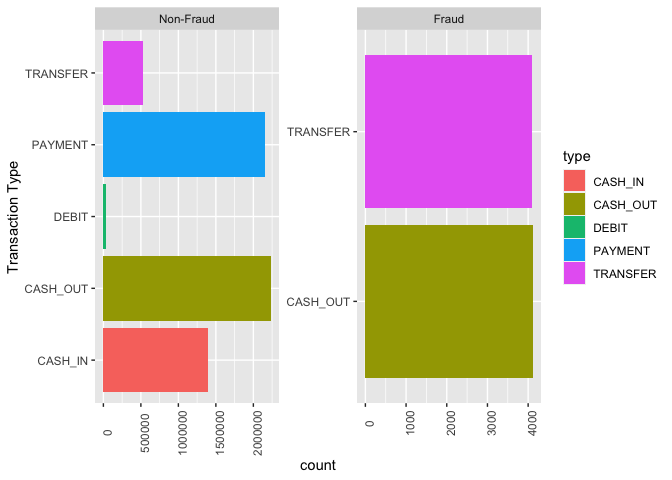
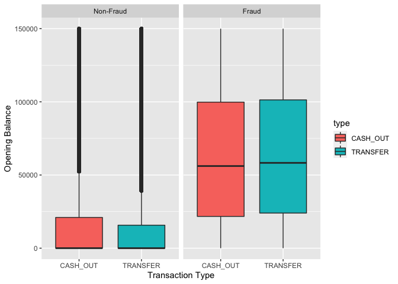
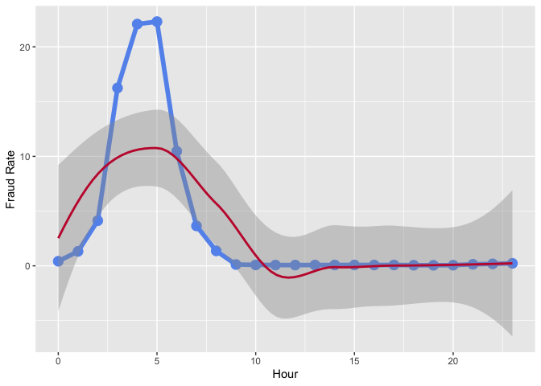

EDA of a Synthetic Financial Dataset
================
Anshul Rao

``` r
library(readr)
library(tidyr)
library(dplyr)
library(ggplot2)
library(tidyverse)
```

### About the dataset.

It has simulated mobile money transactions based on a sample of real
transactions extracted from one month of financial logs from a mobile
money service implemented in an African country. The original logs were
provided by a multinational company, who is the provider of the mobile
financial service which is currently running in more than 14 countries
all around the world.

The different variables/columns in the dataset are as follows:-

-   **step** - Maps a unit of time in the real world. In this case 1
    step is 1 hour of time. Total steps 744 (30 days simulation).
-   **type** - CASH-IN, CASH-OUT, DEBIT, PAYMENT and TRANSFER.
-   **amount** - Amount of the transaction in local currency.
-   **nameOrig** - Customer who intiated the transaction.
-   **oldbalanceOrg** - Initial balance before the transaction.
-   **newbalanceOrig** - New balance after the transaction.
-   **nameDest** - Customer who is the recipient of the transaction.
-   **oldbalanceDest** - Initial balance of recipient before the
    transaction.
-   **newbalanceDest** - New balance recipient after the transaction.
-   **isFraud** - This are the transactions made by the fraudulent
    agents inside the simulation. In this specific dataset the
    fraudulent behavior of the agents aims to profit by taking control
    or customers accounts and try to empty the funds by transferring to
    another account and then cashing out of the system.
-   **isFlaggedFraud** - The business model aims to control massive
    transfers from one account to another and flags illegal attempts. An
    illegal attempt in this dataset is an attempt to transfer more than
    200,000 in a single transaction.

### Importing the dataset.

``` r
# Dataset: https://www.kaggle.com/ealaxi/paysim1
raw_data <- read_csv('data.csv')
```

    ## Rows: 6362620 Columns: 11

    ## ── Column specification ────────────────────────────────────────────────────────
    ## Delimiter: ","
    ## chr (3): type, nameOrig, nameDest
    ## dbl (8): step, amount, oldbalanceOrg, newbalanceOrig, oldbalanceDest, newbal...

    ## 
    ## ℹ Use `spec()` to retrieve the full column specification for this data.
    ## ℹ Specify the column types or set `show_col_types = FALSE` to quiet this message.

### Checking various attributes of the dataset.

#### 1. Dimensions

``` r
dim(raw_data)
```

    ## [1] 6362620      11

#### 2. Glimpse

``` r
glimpse(raw_data)
```

    ## Rows: 6,362,620
    ## Columns: 11
    ## $ step           <dbl> 1, 1, 1, 1, 1, 1, 1, 1, 1, 1, 1, 1, 1, 1, 1, 1, 1, 1, 1…
    ## $ type           <chr> "PAYMENT", "PAYMENT", "TRANSFER", "CASH_OUT", "PAYMENT"…
    ## $ amount         <dbl> 9839.64, 1864.28, 181.00, 181.00, 11668.14, 7817.71, 71…
    ## $ nameOrig       <chr> "C1231006815", "C1666544295", "C1305486145", "C84008367…
    ## $ oldbalanceOrg  <dbl> 170136.0, 21249.0, 181.0, 181.0, 41554.0, 53860.0, 1831…
    ## $ newbalanceOrig <dbl> 160296.36, 19384.72, 0.00, 0.00, 29885.86, 46042.29, 17…
    ## $ nameDest       <chr> "M1979787155", "M2044282225", "C553264065", "C38997010"…
    ## $ oldbalanceDest <dbl> 0, 0, 0, 21182, 0, 0, 0, 0, 0, 41898, 10845, 0, 0, 0, 0…
    ## $ newbalanceDest <dbl> 0.00, 0.00, 0.00, 0.00, 0.00, 0.00, 0.00, 0.00, 0.00, 4…
    ## $ isFraud        <dbl> 0, 0, 1, 1, 0, 0, 0, 0, 0, 0, 0, 0, 0, 0, 0, 0, 0, 0, 0…
    ## $ isFlaggedFraud <dbl> 0, 0, 0, 0, 0, 0, 0, 0, 0, 0, 0, 0, 0, 0, 0, 0, 0, 0, 0…

#### 3. Structure

``` r
str(raw_data)
```

    ## spec_tbl_df [6,362,620 × 11] (S3: spec_tbl_df/tbl_df/tbl/data.frame)
    ##  $ step          : num [1:6362620] 1 1 1 1 1 1 1 1 1 1 ...
    ##  $ type          : chr [1:6362620] "PAYMENT" "PAYMENT" "TRANSFER" "CASH_OUT" ...
    ##  $ amount        : num [1:6362620] 9840 1864 181 181 11668 ...
    ##  $ nameOrig      : chr [1:6362620] "C1231006815" "C1666544295" "C1305486145" "C840083671" ...
    ##  $ oldbalanceOrg : num [1:6362620] 170136 21249 181 181 41554 ...
    ##  $ newbalanceOrig: num [1:6362620] 160296 19385 0 0 29886 ...
    ##  $ nameDest      : chr [1:6362620] "M1979787155" "M2044282225" "C553264065" "C38997010" ...
    ##  $ oldbalanceDest: num [1:6362620] 0 0 0 21182 0 ...
    ##  $ newbalanceDest: num [1:6362620] 0 0 0 0 0 ...
    ##  $ isFraud       : num [1:6362620] 0 0 1 1 0 0 0 0 0 0 ...
    ##  $ isFlaggedFraud: num [1:6362620] 0 0 0 0 0 0 0 0 0 0 ...
    ##  - attr(*, "spec")=
    ##   .. cols(
    ##   ..   step = col_double(),
    ##   ..   type = col_character(),
    ##   ..   amount = col_double(),
    ##   ..   nameOrig = col_character(),
    ##   ..   oldbalanceOrg = col_double(),
    ##   ..   newbalanceOrig = col_double(),
    ##   ..   nameDest = col_character(),
    ##   ..   oldbalanceDest = col_double(),
    ##   ..   newbalanceDest = col_double(),
    ##   ..   isFraud = col_double(),
    ##   ..   isFlaggedFraud = col_double()
    ##   .. )
    ##  - attr(*, "problems")=<externalptr>

#### 4. Summary

``` r
summary(raw_data)
```

    ##       step           type               amount           nameOrig        
    ##  Min.   :  1.0   Length:6362620     Min.   :       0   Length:6362620    
    ##  1st Qu.:156.0   Class :character   1st Qu.:   13390   Class :character  
    ##  Median :239.0   Mode  :character   Median :   74872   Mode  :character  
    ##  Mean   :243.4                      Mean   :  179862                     
    ##  3rd Qu.:335.0                      3rd Qu.:  208721                     
    ##  Max.   :743.0                      Max.   :92445517                     
    ##  oldbalanceOrg      newbalanceOrig       nameDest         oldbalanceDest     
    ##  Min.   :       0   Min.   :       0   Length:6362620     Min.   :        0  
    ##  1st Qu.:       0   1st Qu.:       0   Class :character   1st Qu.:        0  
    ##  Median :   14208   Median :       0   Mode  :character   Median :   132706  
    ##  Mean   :  833883   Mean   :  855114                      Mean   :  1100702  
    ##  3rd Qu.:  107315   3rd Qu.:  144258                      3rd Qu.:   943037  
    ##  Max.   :59585040   Max.   :49585040                      Max.   :356015889  
    ##  newbalanceDest         isFraud         isFlaggedFraud   
    ##  Min.   :        0   Min.   :0.000000   Min.   :0.0e+00  
    ##  1st Qu.:        0   1st Qu.:0.000000   1st Qu.:0.0e+00  
    ##  Median :   214661   Median :0.000000   Median :0.0e+00  
    ##  Mean   :  1224996   Mean   :0.001291   Mean   :2.5e-06  
    ##  3rd Qu.:  1111909   3rd Qu.:0.000000   3rd Qu.:0.0e+00  
    ##  Max.   :356179279   Max.   :1.000000   Max.   :1.0e+00

``` r
# Fixing a small typo in a column name.
names(raw_data)[names(raw_data)=="oldbalanceOrg"] <- c("oldbalanceOrig")
```

``` r
# Rename columns to lowercase.
data  <- rename_all(raw_data, tolower)
```

``` r
# Changing character columns to factor since they are categorical.
data$type <- as.factor(data$type)
data$nameorig <- as.factor(data$nameorig)
data$namedest <- as.factor(data$namedest)
```

``` r
# Printing the first few lines of the dataset.
head(data)
```

    ## # A tibble: 6 × 11
    ##    step type     amount nameorig    oldbalanceorig newbalanceorig namedest   
    ##   <dbl> <fct>     <dbl> <fct>                <dbl>          <dbl> <fct>      
    ## 1     1 PAYMENT   9840. C1231006815         170136        160296. M1979787155
    ## 2     1 PAYMENT   1864. C1666544295          21249         19385. M2044282225
    ## 3     1 TRANSFER   181  C1305486145            181             0  C553264065 
    ## 4     1 CASH_OUT   181  C840083671             181             0  C38997010  
    ## 5     1 PAYMENT  11668. C2048537720          41554         29886. M1230701703
    ## 6     1 PAYMENT   7818. C90045638            53860         46042. M573487274 
    ## # … with 4 more variables: oldbalancedest <dbl>, newbalancedest <dbl>,
    ## #   isfraud <dbl>, isflaggedfraud <dbl>

``` r
# Removing "isflaggedfraud" column.
data <- subset(data, select = -c(isflaggedfraud))
```

``` r
# Creating a new column fraud_label that has 'Fraud' for 1 value in isfraud and
# 'Non-Fraud' for 0 value in isfraud variable.
data$fraud_label <- factor(data$isfraud, labels = c("Non-Fraud", "Fraud"))
```

``` r
# Helper function to check if NA values are present in the data frame.
countNA <- function(data, byrow = FALSE) {
  if(byrow) {
    # MARGIN = 1 in apply indicates rows.
    answer <- apply(data, 
                    MARGIN = 1, 
                    FUN = function(x) {sum(is.na(x))})
  }
  else {
    # MARGIN = 2 in apply indicates columns.
    answer <- apply(data, 
                    MARGIN = 2, 
                    FUN = function(x) {sum(is.na(x))})
  }
  return(answer)
}
```

``` r
# Check if any of the columns has NA values.
countNA(data)
```

    ##           step           type         amount       nameorig oldbalanceorig 
    ##              0              0              0              0              0 
    ## newbalanceorig       namedest oldbalancedest newbalancedest        isfraud 
    ##              0              0              0              0              0 
    ##    fraud_label 
    ##              0

-   The dataset was already structured and no tidying as such was
    needed.
-   Each transaction makes one observation and each variable has its own
    column.
-   There was no need to handle missing values either because there are
    no nulls.
-   Only minor cleaning was done as can be seen in the steps above.

``` r
# Checking how many fraudulent observations are present in the dataset.
data %>%
  group_by(isfraud) %>%
  summarise(n())
```

    ## # A tibble: 2 × 2
    ##   isfraud   `n()`
    ##     <dbl>   <int>
    ## 1       0 6354407
    ## 2       1    8213

### What kind of transactions are fraudulent?

``` r
plot <- ggplot(data, aes(x = type, fill = type)) + 
  geom_bar(position = "dodge") +
  facet_wrap(~fraud_label, scales = "free") +
  labs(x = "Transaction Type") +
  coord_flip() +
  theme(axis.text.x = element_text(angle = 90)) 
```

``` r
plot
```

<!-- -->

-   If we look at the plot above then we can see that the type of
    fraudulent transactions belong to only two categories: Transfer and
    Cash-Out.
-   In fact, a close look at the scale in both fraudulent and
    non-fraudulent transactions tells use that the amount of fraudulent
    transactions are very less compared to the non-fraudulent.
-   In fact, only 8213 observations out of 6362620 are fraudulent.

### Is there some visible difference between the opening balance of fraudulent and non-fraudulent transactions?

``` r
# Considering only transaction types in which fraud have occurred in
# the dataset.
# Also, chopping off the tail for better visualization closer to the IQR.
plot <- data %>%
  filter(type %in% c("TRANSFER", "CASH_OUT"), 
         oldbalanceorig < 150000) %>%
  ggplot(aes(y = oldbalanceorig, 
             x = type,
             fill = type)) + 
  geom_boxplot() + 
  facet_wrap(~fraud_label) +
  labs(x = "Transaction Type", y = "Opening Balance")
```

``` r
plot
```

<!-- -->

-   If we look at the plot below then we can see that the median of
    opening balance is much higher in fraudulent transactions as
    compared to non-fraudulent ones.
-   This makes sense since the fraudsters will not transfer small
    amounts but will do bigger transactions only.

### Does the fraud happen during a specific time of the day?

``` r
plot <- data %>%
  mutate(step = step %% 24) %>%
  group_by(step) %>%
  summarise(fraud_txns = sum(isfraud),
            no_of_txns = n()) %>%
  mutate(fraud_rate = ( fraud_txns/no_of_txns ) * 100) %>%
  ggplot(aes(x = step, y = fraud_rate)) + 
  geom_point(size=4, color="#6495ED") +
  geom_line(size=2, color="#6495ED") +
  geom_smooth(method = 'loess', formula = 'y ~ x', color="#C41E3A") +
  labs(x = "Hour",
       y = "Fraud Rate")
```

``` r
plot
```

<!-- -->

-   The data simulation has been done for 30 days and has 744 steps
    (hours).
-   On checking the rate of frauds done every 24 hours a pattern was
    seen where most frauds occur around 5 AM, as can be seen in the plot
    above.
-   This seems to make sense since a fraudster would pick a time when
    most people are offline.

------------------------------------------------------------------------
